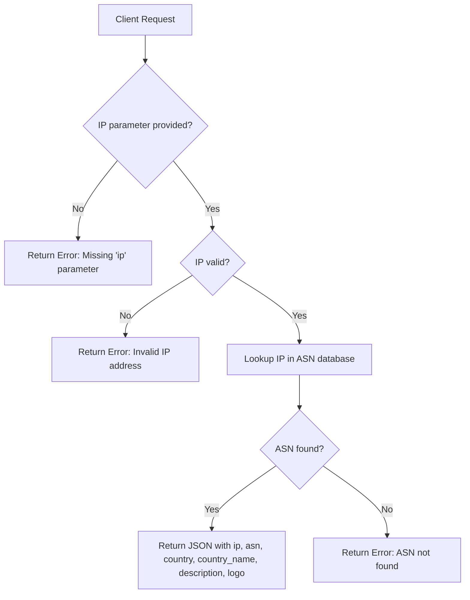

# IP-to-ASN Lookup API (fast hehe)

This API allows you to lookup the **ASN**, **country**, **country name**, and **provider name** for a given IPv4 or IPv6 address. This API uses an very Optimzed Cache to have very fast response times. The API does Support Quic (http3) and http2 to deliver fast responses! ⚡

## Base URL

```
https://cdn.t-w.dev/whois?ip={IP}&locale={locale}
```

* `locale` (optional) – `de`, `en`, or `both` (default: `both`)

---

## Request

### Method

* **GET** or **POST**

### Parameters

| Name   | Type   | Required | Description                                     |
| ------ | ------ | -------- | ----------------------------------------------- |
| ip     | string | Yes      | IPv4 or IPv6 address to query                   |
| locale | string | No       | Language for `country_name`: `de`, `en`, `both` |

---

## Response

### Success (200)

| Field         | Type   | Description                               |
| ------------- | ------ | ----------------------------------------- |
| ip            | string | The queried IP address                    |
| asn           | string | Autonomous System Number                  |
| country       | string | 2-letter country code of the ASN          |
| country\_name | string | Localized country name (`locale` applied) |
| description   | string | Cleaned provider name (normalized)        |
| logo          | string | Provider logo (not all)                   |

**Example:**

```json
{
  "ip": "8.8.8.8",
  "asn": "15169",
  "country": "US",
  "country_name": "United States / Vereinigte Staaten",
  "description": "Google",
  "logo": "https://cdn.t-w.dev/img/Google.webp"
}
```

### Error (400+)

| Field | Type   | Description                |
| ----- | ------ | -------------------------- |
| error | string | Description of the problem |

**Possible errors:**

```json
{ "error": "Missing 'ip' parameter" }
```

```json
{ "error": "Invalid IP address" }
```

```json
{ "error": "ASN not found for given IP" }
```

---

## API Flow


