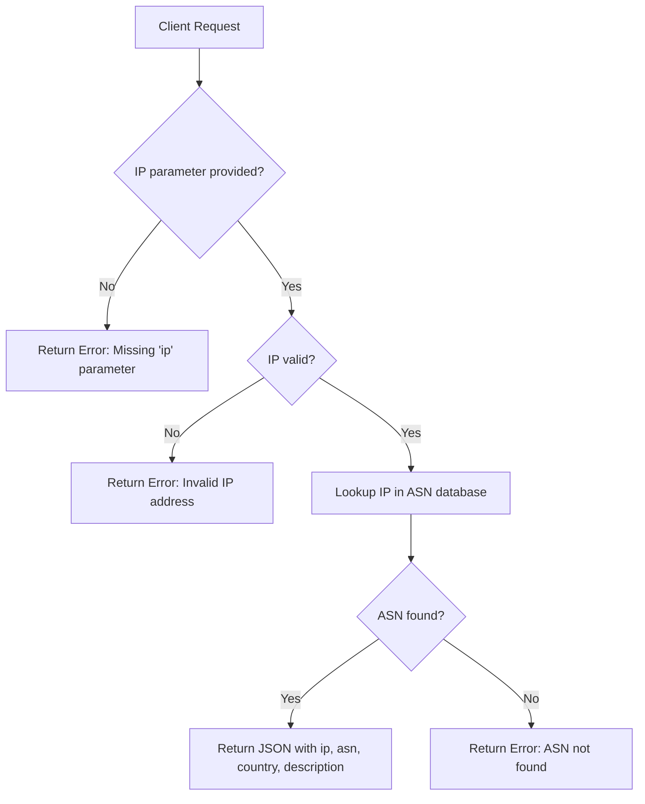

# IP-to-ASN Lookup API (fast hehe)

This API allows you to lookup the **ASN**, **country**, and **provider name** for a given IPv4 or IPv6 address.

## Base URL

```
https://cdn.t-w.dev/whois?ip={IP}
```

---

## Request

### Method

* **GET** or **POST**

### Parameters

| Name | Type   | Required | Description                   |
| ---- | ------ | -------- | ----------------------------- |
| ip   | string | Yes      | IPv4 or IPv6 address to query |

---

## Response

### Success (200)

| Field       | Type   | Description                        |
| ----------- | ------ | ---------------------------------- |
| ip          | string | The queried IP address             |
| asn         | string | Autonomous System Number           |
| country     | string | 2-letter country code of the ASN   |
| description | string | Cleaned provider name (normalized) |
| logo        | string | Provider logo (not all)            |

**Example:**

```json
{
  "ip": "8.8.8.8",
  "asn": "15169",
  "country": "US",
  "description": "Google",
  "logo": "https://cdn.t-w.dev/img/Google.webp"
}
```

### Error (400+)

| Field | Type   | Description                |
| ----- | ------ | -------------------------- |
| error | string | Description of the problem |

**Examples:**

```json
{ "error": "Missing 'ip' parameter" }
```

```json
{ "error": "Invalid IP address" }
```

```json
{ "error": "ASN not found for given IP" }
```

---

## API Flow


